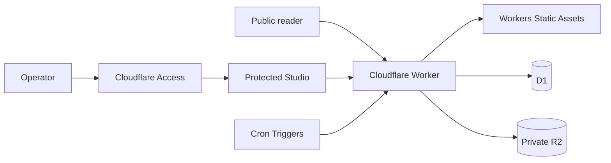

# Personal Space

**English** | [繁體中文](README.md) | [簡體中文](README.zh-Hans.md)

[](https://github.com/kyeunga25/personal-space/actions/workflows/ci.yml)

A bilingual publishing application built with Astro and Cloudflare Workers. It
provides public notes, articles, reviewed editions, and an operator-only content
management surface.

[Live site](https://space.k-y.cc) ·
[Health check](https://space.k-y.cc/api/health) ·
[Documentation](docs/README.md) ·
[Changelog](CHANGELOG.md) ·
[Releases](https://github.com/kyeunga25/personal-space/releases)

> Repository-owned software and related technical documentation are available
> under [GNU AGPL v3.0 only](LICENSE). Branding, user or operator data, and
> third-party material are excluded; see [Licensing Scope](LICENSING.md).

## What this project is

Personal Space is a full-stack publishing site managed by one operator. Public
readers can browse content, search, use categories and tags, explore monthly
archives, and subscribe to RSS feeds without an account. Drafts, media, sources,
revisions, and publishing controls remain in the protected Studio.

This is not a static-only template. Astro produces Cloudflare-compatible server
output; a Worker handles dynamic pages, APIs, and optional scheduled events;
Workers Static Assets serves built assets; and each operator's D1 database and
private R2 bucket hold application data and media.

## Current status

| Area             | Status                                          | Evidence                                                                            |
| ---------------- | ----------------------------------------------- | ----------------------------------------------------------------------------------- |
| Public reading   | Available                                       | [Live site](https://space.k-y.cc) · [Health check](https://space.k-y.cc/api/health) |
| Management       | Single operator; protected by Cloudflare Access | [Security policy](SECURITY.md)                                                      |
| Source           | `v0.8.0`; ongoing integration on `main`         | [`package.json`](package.json) · [`CHANGELOG.md`](CHANGELOG.md)                     |
| GitHub Release   | `v0.8.0`                                        | [Latest release](https://github.com/kyeunga25/personal-space/releases/latest)       |
| Deployment model | Cloudflare Workers + Static Assets + D1 + R2    | [Self-hosting guide](docs/SELF_HOSTING.md)                                          |

A local build, CI run, preview, GitHub Release, and production deployment are
different forms of evidence. See [Project status](docs/STATUS.md) for the exact
definitions.

## Features

- Public note and long-form article indexes, detail pages, and reading time;
- full-text search, chronological stream, categories, tags, and monthly archives;
- separate RSS feeds for Notes, Articles, and Editions, plus a sitemap;
- draft, preview, publish, schedule, archive, and revision workflows;
- validated image uploads and controlled media responses;
- optional RSS/Atom retrieval, human review, and Edition publishing;
- responsive public and Studio interfaces;
- fail-closed handling for unpublished content, private media, and protected routes.

The current scope excludes multi-tenancy, public accounts, public submissions,
subscriptions, payments, and generative AI at runtime. See the
[project overview](docs/PROJECT_OVERVIEW.md) for the complete boundary.

## Architecture at a glance



| Area            | Technology                                  | Responsibility                               |
| --------------- | ------------------------------------------- | -------------------------------------------- |
| Application     | Astro, TypeScript                           | Pages, APIs, server output, and UI           |
| Runtime         | Cloudflare Workers                          | Dynamic requests, APIs, and scheduled events |
| Static delivery | Workers Static Assets                       | CSS, SVG, and other built assets             |
| Data            | Cloudflare D1                               | Operator-owned content and application data  |
| Media           | Cloudflare R2                               | Operator-owned private media objects         |
| Access          | Cloudflare Access + application owner check | Protects Studio and write operations         |
| Quality         | ESLint, Prettier, Astro check, Vitest       | Formatting, analysis, types, and tests       |

Pinned package versions are recorded in [`package.json`](package.json) and
[`package-lock.json`](package-lock.json).

## Quick start

Requirements: Node.js 22.22.3 or newer and npm 10 or newer.

```bash
npm ci
npm run db:migrate:local
npm run dev
```

To test Studio on a loopback development URL, create a local configuration that
contains synthetic values only:

```bash
cp .dev.vars.example .dev.vars
```

Run the complete checks and preview the built Worker:

```bash
npm run check
npm run preview
```

See the [development guide](docs/DEVELOPMENT.md) for commands, directory
responsibilities, and the test strategy.
See the [usage guide](docs/USAGE.md) for complete reader and Studio workflows.

## Self-hosting summary

Deployment changes your Cloudflare account. Read the complete
[Cloudflare self-hosting guide](docs/SELF_HOSTING.md) before any remote step and
confirm that you have permission to use the source.

1. Create a fresh D1 database and private R2 bucket in your own Cloudflare account.
2. Copy the public template to the Git-ignored `wrangler.self-host.jsonc`.
3. Put your own resource names and identifiers only in that private file; keep the binding names unchanged.
4. Run local migrations, `npm run check`, a private-config build, and a Wrangler dry-run.
5. Apply D1 migrations with `--remote`, then deploy to a `workers.dev` test URL.
6. Configure Cloudflare Access, application secrets, and protection for `/studio` and its APIs.
7. Verify public routes, protected routes, D1, R2, logs, and Git state before attaching a custom domain.

The repository contains no production secrets, real content, Cloudflare resource
identifiers, Access configuration, logs, or backups. It intentionally has no
one-click flow that would bypass those checks.

## Repository map

| Path             | Contents                                                               |
| ---------------- | ---------------------------------------------------------------------- |
| `src/pages`      | Public pages, Studio pages, and API routes                             |
| `src/components` | Shared public and Studio UI components                                 |
| `src/server`     | Authentication, publishing, sources, feeds, media, and HTTP boundaries |
| `src/worker.ts`  | Cloudflare Worker fetch and scheduled entry points                     |
| `migrations`     | Versioned D1 migrations for a fresh environment                        |
| `tests`          | Unit and boundary tests that use synthetic data                        |
| `examples`       | Markdown examples without production data                              |
| `docs`           | Current guidance and historical design/delivery records                |

## Documentation

| Document                                     | Purpose                                                     |
| -------------------------------------------- | ----------------------------------------------------------- |
| [Documentation index](docs/README.md)        | Reading order, current documents, and historical records    |
| [Project overview](docs/PROJECT_OVERVIEW.md) | Product scope, architecture, data responsibility, and stack |
| [Usage guide](docs/USAGE.md)                 | Public reading, Studio, content, media, and Editions        |
| [Interface design](docs/DESIGN.md)           | Color roles, layouts, components, responsive and a11y rules |
| [Development guide](docs/DEVELOPMENT.md)     | Local setup, commands, tests, and contribution workflow     |
| [Self-hosting guide](docs/SELF_HOSTING.md)   | Workers, D1, R2, Access, domains, and rollback              |
| [Verification guide](docs/VERIFICATION.md)   | Isolated local, read-only production, and release QA        |
| [Project status](docs/STATUS.md)             | Version, maturity, and evidence definitions                 |
| [Security policy](SECURITY.md)               | Private vulnerability reporting and deployment requirements |
| [Changelog](CHANGELOG.md)                    | Public-safe release summaries                               |

## Contributing, support, and security

- For ordinary bugs or feature proposals, use
  [GitHub Issues](https://github.com/kyeunga25/personal-space/issues/new/choose).
- Before a substantial change, read [CONTRIBUTING.md](CONTRIBUTING.md) and open
  an issue to align the scope.
- For security concerns, follow [SECURITY.md](SECURITY.md) and use Private
  vulnerability reporting instead of a public issue.

Issues, pull requests, screenshots, and logs must not contain secrets, real
content, personal data, Cloudflare identifiers, or local absolute paths.

## Copyright and usage

Copyright © 2026 `kyeunga25`.

Repository-owned software, tests, build scripts, and related technical
documentation are licensed under [`AGPL-3.0-only`](LICENSE). Operators of a
modified version over a network must account for the corresponding-source duty
in section 13. Branding, content and data supplied by users, authors, or
operators, private configuration, and third-party material are excluded. Read
[`LICENSING.md`](LICENSING.md), [`COPYRIGHT.md`](COPYRIGHT.md), and
[`THIRD_PARTY_NOTICES.md`](THIRD_PARTY_NOTICES.md).
