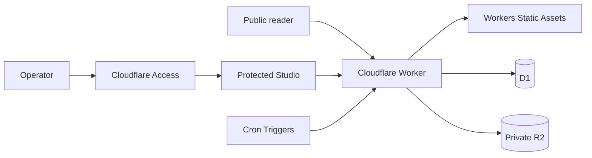

# Personal Space

[English](README.en.md) | **繁體中文** | [簡體中文](README.zh-Hans.md)

[](https://github.com/kyeunga25/personal-space/actions/workflows/ci.yml)

以 Astro 與 Cloudflare Workers 建立的雙語內容發佈系統，提供公開筆記、文章、
人工審閱選輯，以及只限部署者使用的內容管理介面。

[公開網站](https://space.k-y.cc) ·
[健康檢查](https://space.k-y.cc/api/health) ·
[文檔](docs/README.md) ·
[版本記錄](CHANGELOG.md) ·
[Releases](https://github.com/kyeunga25/personal-space/releases)

> 本 repository 公開原始碼，但目前沒有授予開源 LICENSE。技術文件與部署步驟不等同
> 授予複製、修改、部署或再發佈權；詳見 [版權與使用權](COPYRIGHT.md)。

## 專案定位

Personal Space 是一個單一部署者管理的全端發佈網站。公開讀者無需登入即可瀏覽
內容、搜尋、分類、標籤、月份封存、RSS feeds 及 sitemap；草稿、媒體、來源、修訂
與發佈工作則留在受保護的 Studio。

這不是純靜態模板。Astro 產生 Cloudflare 相容的 server output，Worker 處理動態
頁面、API 與可選排程事件，Workers Static Assets 提供建置後資產，D1 與私人 R2
分別保存部署者自己的應用資料和媒體。

## 目前狀態

| 項目           | 狀態                                         | 可核對資料                                                                  |
| -------------- | -------------------------------------------- | --------------------------------------------------------------------------- |
| 公開閱讀       | 可用                                         | [網站](https://space.k-y.cc) · [健康檢查](https://space.k-y.cc/api/health)  |
| 管理介面       | 單一部署者、Cloudflare Access 保護           | [安全政策](SECURITY.md)                                                     |
| Source         | `v0.8.0`，`main` 持續整合                    | [`package.json`](package.json) · [`CHANGELOG.md`](CHANGELOG.md)             |
| GitHub Release | `v0.8.0`                                     | [最新 Release](https://github.com/kyeunga25/personal-space/releases/latest) |
| 部署模型       | Cloudflare Workers + Static Assets + D1 + R2 | [自部署指南](docs/SELF_HOSTING.md)                                          |

本地 build、CI、preview、GitHub Release 與 production 是不同證據；完整定義見
[專案狀態](docs/STATUS.md)。

## 主要功能

- 公開筆記與長篇文章的列表、詳情及閱讀時間；
- 全文搜尋、時間動態、分類、標籤與月份封存；
- Notes、Articles、Editions 的獨立 RSS feeds，以及 sitemap；
- 草稿、預覽、發佈、排程、封存及修訂工作流；
- 經驗證的圖片上載與受控媒體回應；
- 可選的 RSS／Atom 來源擷取、人工審閱及 Edition 發佈；
- 響應式公開介面與 Studio；
- 對未發佈內容、私人媒體及受保護路由採取 fail-closed 行為。

不在目前範圍內：多租戶、公開帳戶、公開投稿、訂閱、付款，以及 runtime 生成式
AI。完整產品邊界見 [專案概覽](docs/PROJECT_OVERVIEW.md)。

## 架構摘要



| 範疇            | 技術                                  | 責任                            |
| --------------- | ------------------------------------- | ------------------------------- |
| Application     | Astro、TypeScript                     | 頁面、API、server output 與介面 |
| Runtime         | Cloudflare Workers                    | 動態請求、API 及排程事件        |
| Static delivery | Workers Static Assets                 | CSS、SVG 及其他建置資產         |
| Data            | Cloudflare D1                         | 部署者自己的內容及應用資料      |
| Media           | Cloudflare R2                         | 部署者自己的私人媒體物件        |
| Access          | Cloudflare Access + 應用層 owner 核對 | 保護 Studio 及寫入操作          |
| Quality         | ESLint、Prettier、Astro check、Vitest | 格式、靜態分析、型別及測試      |

套件的固定版本以 [`package.json`](package.json) 及
[`package-lock.json`](package-lock.json) 為準。

## 快速開始

需求：Node.js 22.22.3 或以上、npm 10 或以上。

```bash
npm ci
npm run db:migrate:local
npm run dev
```

如需在 loopback 環境測試 Studio，可先建立只含虛構值的本機設定：

```bash
cp .dev.vars.example .dev.vars
```

完整檢查與 built-Worker 預覽：

```bash
npm run check
npm run preview
```

各指令、目錄責任與測試策略見 [開發指南](docs/DEVELOPMENT.md)。

## 自行部署摘要

部署會修改你的 Cloudflare 帳戶。執行遠端步驟前，請先閱讀完整的
[Cloudflare 自部署指南](docs/SELF_HOSTING.md)，並確認你有權使用本程式碼。

1. 以自己的 Cloudflare 帳戶建立全新的 D1 database 與私人 R2 bucket。
2. 複製公開範本至已被 Git 忽略的 `wrangler.self-host.jsonc`。
3. 只在該私人設定填入自己的資源名稱與 identifiers；不要修改 binding 名稱。
4. 執行本地 migration、`npm run check`、私人設定 build 與 Wrangler dry-run。
5. 以 `--remote` 對全新 D1 套用 migration，再部署至 `workers.dev` 測試網址。
6. 設定 Cloudflare Access、應用程式 secrets，以及 `/studio` 和相關 API 的保護。
7. 核對公開頁、受保護路由、D1、R2、logs 與 Git 狀態後，才連接自訂 domain。

Repository 不保存 production secrets、真實內容、Cloudflare resource identifiers、
Access 設定、logs 或備份。它也沒有提供會略過這些核對的一鍵部署流程。

## Repository 導覽

| 位置             | 內容                                      |
| ---------------- | ----------------------------------------- |
| `src/pages`      | 公開頁面、Studio 頁面及 API routes        |
| `src/components` | 共用公開與 Studio 介面元件                |
| `src/server`     | 認證、發佈、來源、feeds、媒體與 HTTP 邊界 |
| `src/worker.ts`  | Cloudflare Worker fetch／scheduled 入口   |
| `migrations`     | 可重建空白環境的版本化 D1 migrations      |
| `tests`          | 使用合成資料的單元與邊界測試              |
| `examples`       | 不含 production 資料的 Markdown 範例      |
| `docs`           | 目前說明與歷史設計／交付記錄              |

## 文檔

| 文件                                 | 用途                                        |
| ------------------------------------ | ------------------------------------------- |
| [文檔索引](docs/README.md)           | 目前文檔、歷史記錄與閱讀順序                |
| [專案概覽](docs/PROJECT_OVERVIEW.md) | 產品範圍、架構、資料責任與技術棧            |
| [開發指南](docs/DEVELOPMENT.md)      | 本地環境、指令、測試與貢獻流程              |
| [自部署指南](docs/SELF_HOSTING.md)   | Workers、D1、R2、Access、domain 及 rollback |
| [專案狀態](docs/STATUS.md)           | 版本、成熟度與證據定義                      |
| [安全政策](SECURITY.md)              | 私人漏洞回報與部署安全要求                  |
| [更新記錄](CHANGELOG.md)             | 公開安全的版本變更摘要                      |

## 貢獻、支援與安全

- 一般錯誤或功能建議：使用 [GitHub Issues](https://github.com/kyeunga25/personal-space/issues/new/choose)。
- 開始較大改動前：先閱讀 [貢獻指南](CONTRIBUTING.md) 並建立 issue 對齊範圍。
- 安全問題：依 [安全政策](SECURITY.md) 使用 Private vulnerability reporting，
  不要建立公開 issue。

Issue、PR、截圖與 logs 都不得包含 secret、真實內容、私人資料、Cloudflare
identifiers 或本機絕對路徑。

## 版權與使用權

Copyright © 2026 `kyeunga25`. All rights reserved.

除非個別檔案另有明確授權，本 repository 沒有授予開源 LICENSE。公開可讀與可被
GitHub fork 不等同授予使用、修改、部署或再發佈權。詳見
[`COPYRIGHT.md`](COPYRIGHT.md)。第三方套件及內容仍受各自條款約束。
