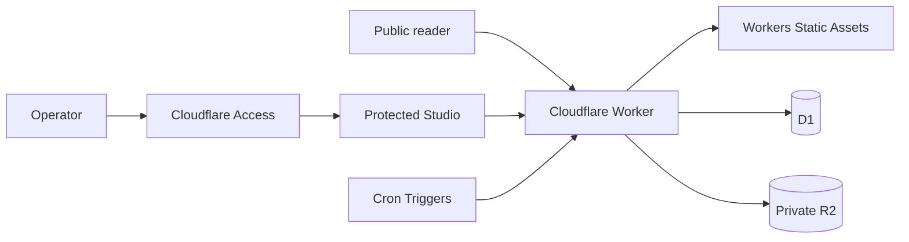

# Personal Space

[English](README.en.md) | [繁體中文](README.md) | **簡體中文**

[](https://github.com/kyeunga25/personal-space/actions/workflows/ci.yml)

使用 Astro 与 Cloudflare Workers 构建的双语内容发布系统，提供公开笔记、文章、
人工审核选辑，以及仅限部署者使用的内容管理界面。

[公开网站](https://space.k-y.cc) ·
[健康检查](https://space.k-y.cc/api/health) ·
[文档](docs/README.md) ·
[版本记录](CHANGELOG.md) ·
[Releases](https://github.com/kyeunga25/personal-space/releases)

> 本 repository 公开源代码，但目前没有授予开源 LICENSE。技术文档与部署步骤不等于
> 授予复制、修改、部署或再发布权；详见 [版权与使用权](COPYRIGHT.md)。

## 项目定位

Personal Space 是一个由单一部署者管理的全栈发布网站。公开读者无需登录即可浏览
内容、搜索、分类、标签、月份归档、RSS feeds 及 sitemap；草稿、媒体、来源、修订
与发布工作则保留在受保护的 Studio。

这不是纯静态模板。Astro 生成 Cloudflare 兼容的 server output，Worker 处理动态
页面、API 与可选定时事件，Workers Static Assets 提供构建后的资源，D1 与私有 R2
分别保存部署者自己的应用数据和媒体。

## 当前状态

| 项目           | 状态                                         | 可核对资料                                                                  |
| -------------- | -------------------------------------------- | --------------------------------------------------------------------------- |
| 公开阅读       | 可用                                         | [网站](https://space.k-y.cc) · [健康检查](https://space.k-y.cc/api/health)  |
| 管理界面       | 单一部署者、Cloudflare Access 保护           | [安全政策](SECURITY.md)                                                     |
| Source         | `v0.8.0`，`main` 持续集成                    | [`package.json`](package.json) · [`CHANGELOG.md`](CHANGELOG.md)             |
| GitHub Release | `v0.8.0`                                     | [最新 Release](https://github.com/kyeunga25/personal-space/releases/latest) |
| 部署模型       | Cloudflare Workers + Static Assets + D1 + R2 | [自部署指南](docs/SELF_HOSTING.md)                                          |

本地 build、CI、preview、GitHub Release 与 production 是不同证据；完整定义见
[项目状态](docs/STATUS.md)。

## 主要功能

- 公开笔记与长篇文章的列表、详情及阅读时间；
- 全文搜索、时间动态、分类、标签与月份归档；
- Notes、Articles、Editions 的独立 RSS feeds，以及 sitemap；
- 草稿、预览、发布、定时、归档及修订工作流；
- 经过验证的图片上传与受控媒体响应；
- 可选的 RSS／Atom 来源抓取、人工审核及 Edition 发布；
- 响应式公开界面与 Studio；
- 对未发布内容、私有媒体及受保护路由采取 fail-closed 行为。

目前不包含：多租户、公开账户、公开投稿、订阅、付款，以及 runtime 生成式 AI。
完整产品边界见 [项目概览](docs/PROJECT_OVERVIEW.md)。

## 架构摘要



| 范畴            | 技术                                  | 责任                            |
| --------------- | ------------------------------------- | ------------------------------- |
| Application     | Astro、TypeScript                     | 页面、API、server output 与界面 |
| Runtime         | Cloudflare Workers                    | 动态请求、API 及定时事件        |
| Static delivery | Workers Static Assets                 | CSS、SVG 及其他构建资源         |
| Data            | Cloudflare D1                         | 部署者自己的内容及应用数据      |
| Media           | Cloudflare R2                         | 部署者自己的私有媒体对象        |
| Access          | Cloudflare Access + 应用层 owner 核对 | 保护 Studio 及写入操作          |
| Quality         | ESLint、Prettier、Astro check、Vitest | 格式、静态分析、类型及测试      |

依赖的固定版本以 [`package.json`](package.json) 及
[`package-lock.json`](package-lock.json) 为准。

## 快速开始

要求：Node.js 22.22.3 或以上、npm 10 或以上。

```bash
npm ci
npm run db:migrate:local
npm run dev
```

如需在 loopback 环境测试 Studio，可先创建只含虚构值的本地设置：

```bash
cp .dev.vars.example .dev.vars
```

完整检查与 built-Worker 预览：

```bash
npm run check
npm run preview
```

各指令、目录责任与测试策略见 [开发指南](docs/DEVELOPMENT.md)。
读者与 Studio 的完整内容流程见 [使用指南](docs/USAGE.md)。

## 自行部署摘要

部署会修改你的 Cloudflare 账户。执行远端步骤前，请先阅读完整的
[Cloudflare 自部署指南](docs/SELF_HOSTING.md)，并确认你有权使用本代码。

1. 使用自己的 Cloudflare 账户创建全新的 D1 database 与私有 R2 bucket。
2. 复制公开模板至已被 Git 忽略的 `wrangler.self-host.jsonc`。
3. 只在该私有设置中填写自己的资源名称与 identifiers；不要修改 binding 名称。
4. 执行本地 migration、`npm run check`、私有设置 build 与 Wrangler dry-run。
5. 使用 `--remote` 对全新 D1 执行 migration，再部署到 `workers.dev` 测试网址。
6. 配置 Cloudflare Access、应用 secrets，以及 `/studio` 和相关 API 的保护。
7. 核对公开页面、受保护路由、D1、R2、logs 与 Git 状态后，才连接自定义 domain。

Repository 不保存 production secrets、真实内容、Cloudflare resource identifiers、
Access 设置、logs 或备份。它也没有提供会跳过这些核对的一键部署流程。

## Repository 导览

| 位置             | 内容                                      |
| ---------------- | ----------------------------------------- |
| `src/pages`      | 公开页面、Studio 页面及 API routes        |
| `src/components` | 共用公开与 Studio 界面组件                |
| `src/server`     | 认证、发布、来源、feeds、媒体与 HTTP 边界 |
| `src/worker.ts`  | Cloudflare Worker fetch／scheduled 入口   |
| `migrations`     | 可重建空白环境的版本化 D1 migrations      |
| `tests`          | 使用合成数据的单元与边界测试              |
| `examples`       | 不含 production 数据的 Markdown 示例      |
| `docs`           | 当前说明与历史设计／交付记录              |

## 文档

| 文件                                 | 用途                                        |
| ------------------------------------ | ------------------------------------------- |
| [文档索引](docs/README.md)           | 当前文档、历史记录与阅读顺序                |
| [项目概览](docs/PROJECT_OVERVIEW.md) | 产品范围、架构、数据责任与技术栈            |
| [使用指南](docs/USAGE.md)            | 公开阅读、Studio、内容、媒体与 Editions     |
| [界面设计系统](docs/DESIGN.md)       | 色彩角色、版面、组件、responsive 与可访问性 |
| [开发指南](docs/DEVELOPMENT.md)      | 本地环境、指令、测试与贡献流程              |
| [自部署指南](docs/SELF_HOSTING.md)   | Workers、D1、R2、Access、domain 及 rollback |
| [验证指南](docs/VERIFICATION.md)     | 隔离本地、production 只读及 release QA      |
| [项目状态](docs/STATUS.md)           | 版本、成熟度与证据定义                      |
| [安全政策](SECURITY.md)              | 私人漏洞报告与部署安全要求                  |
| [更新记录](CHANGELOG.md)             | 适合公开的版本变更摘要                      |

## 贡献、支持与安全

- 一般错误或功能建议：使用 [GitHub Issues](https://github.com/kyeunga25/personal-space/issues/new/choose)。
- 开始较大改动前：先阅读 [贡献指南](CONTRIBUTING.md) 并创建 issue 对齐范围。
- 安全问题：按照 [安全政策](SECURITY.md) 使用 Private vulnerability reporting，
  不要创建公开 issue。

Issue、PR、截图与 logs 都不得包含 secret、真实内容、私人数据、Cloudflare
identifiers 或本地绝对路径。

## 版权与使用权

Copyright © 2026 `kyeunga25`. All rights reserved.

除非单独文件另有明确授权，本 repository 没有授予开源 LICENSE。公开可读与可被
GitHub fork 不等于授予使用、修改、部署或再发布权。详见
[`COPYRIGHT.md`](COPYRIGHT.md)。第三方依赖及内容仍受各自条款约束。
