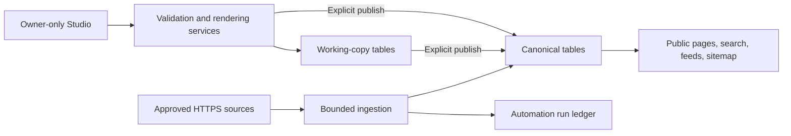

# Editorial and Automation Architecture v0.7.0

狀態 / Status: v0.7.0 架構契約；production 發佈狀態以交付記錄及 GitHub Release
為準。 / Stable v0.7.0 architecture contract; see the delivery record and
GitHub Release for production status.

## 核心原則

1. **公開讀取只看 canonical 資料。** Studio 內未完成的修改不得透過公開頁、
   搜尋、封存、RSS 或 sitemap 洩漏。
2. **已發佈內容必須明確提升。** Autosave 只更新 working copy；只有 Publish
   動作可替換 canonical 版本。
3. **來源先審權利，再允許擷取。** 沒有完整審核記錄的來源不能啟用，也不會被
   Cron 選中。
4. **自動工作有界、可重入、可觀察。** 每次工作量及回應大小有硬上限；相同
   Cron event 不會重複執行，logs 只保存數量與狀態。
5. **安全邊界 fail closed。** 缺少 Access 設定、來源審核、媒體可見性或排程
   到期條件時，系統不會以較寬鬆的行為替代。

## Canonical 與 working-copy 資料

| 資料 | Canonical | Owner-only working copy | 公開讀取 |
| --- | --- | --- | --- |
| Note / Article | `posts`, taxonomy links | `post_working_copies` | 只讀 `posts` |
| Post 修訂 | `post_revisions` | 還原到已發佈內容時先形成 working copy | 不公開 |
| Edition | `editions`, `edition_items` | `edition_working_copies`, `edition_working_items` | 只讀已發佈 canonical Edition |
| 媒體 | `media` + R2 object | 沒有第二份 object；連結由 working copy 保存 | 只提供 `public` media |

### Post 狀態轉換

- 新內容的 Save 建立或更新 canonical draft。
- 已發佈或已排程內容的 Save 寫入 `post_working_copies`，保留原本公開版本。
- Publish／Archive 是明確 canonical 動作；提升後刪除 working copy。
- 已發佈內容不能用 Schedule 直接改成未到期狀態，避免公開頁突然下線。
- 還原已發佈／已排程內容的修訂時先形成 working copy；未發佈 draft 才可直接
  還原 canonical draft。
- 明確替換 live canonical 內容前先保存包含封面媒體、taxonomy 及 Markdown 的
  修訂快照。

### Edition 狀態轉換

- 每個香港日曆日最多建立一份 canonical draft。
- Draft 的 Save 仍更新 canonical draft；Published Edition 的 Save 只更新
  working-copy title、intro、items 及 annotations。
- Publish／Archive 會以目前 Studio 值更新 canonical Edition、同步 source-item
  state，並刪除 working copy。
- 每日 generator 遇到非 draft 或已有項目的 Edition 時保持不變，避免重跑覆蓋
  owner 編輯或公開內容。

## 來源權利與 ingestion 邊界

`sources` 使用 `pending`、`approved`、`rejected` 三種 review status。來源只有在
以下欄位完整時才可設為 `enabled`：

- `review_status = approved`；
- HTTPS `terms_url`；
- 具體 `rights_basis`；
- `reviewed_at` 時間。

`0004_ingestion_governance.sql` 會將既有來源暫停並重設為 pending，不會默認沿用
舊審核。Studio 與 D1 triggers 都執行相同閘門。

每次 ingestion 的固定界線：

- 最多 2 個已核准及啟用的來源；
- 每個來源最多 5 項；
- feed body 串流硬上限 2 MiB，超限即取消 reader；
- 每次 fetch 10 秒 timeout、最多 3 次 redirect；
- 只接受不含 credentials、literal IP、內網 hostname 或非標準 port 的公開
  HTTPS URL；每個 redirect target 重新驗證；
- 只保存清理後的文字、bounded summary、canonical source URL 及條件請求 metadata，
  不擷取 enclosure 或遠端圖片。

來源內容仍受其發佈者條款、版權及連結政策約束。核准記錄只是 ingestion 的必要
條件，不代表 repository 對第三方內容授權作保證；owner 必須按來源逐一審閱。

## Automation run ledger

`automation_runs` 保存 ingestion 與 Edition generation 的執行狀態：

- Cron 以 job + scheduled time 形成唯一 run key；重複 event 返回既有結果，不再
  執行外部 fetch 或資料寫入。
- Manual run 使用獨立 key。
- Running claim 有 14 分鐘 lease；過期 claim 可安全重試並增加 attempt count。
- Terminal status 為 `succeeded`、`partial`、`failed` 或 `skipped`。
- Summary 只保存 attempted／fetched／failed／new item 等數量；error 只保存短
  error code。Worker structured logs 同樣不輸出 source URL、title、summary 或
  private content。
- 所有來源都失敗時，scheduled handler 會令 event 失敗，讓 Cloudflare
  observability 顯示，而不是將空結果誤報為成功。

Cron 採 UTC 設定：`15 0,12 * * *` 對應香港時間 08:15／20:15 ingestion；
`0 14 * * *` 對應 22:00 Edition draft generation。平台 plan、CPU 及 subrequest
配額可能變更，發佈時必須按當前 Cloudflare 限制重新核對，不能只依賴此文件。

## 媒體與公開邊界

- `private` Post 只可連結 `private` media；`public` 或 `unlisted` Post 只可連結
  `public` media。
- Publishing service 在寫入前查核 media；`0006_content_invariants.sql` 在 D1
  insert、update 及 media visibility change 再次執行相同不變量。
- R2 bucket 不直接公開。`/media/:id` 先從 D1 查核 `public` visibility，再讀取
  object。
- 公開 media 使用 `max-age=300, stale-while-revalidate=60`，不把可變 object
  宣告為一年 immutable。

## 公開時間與認證邊界

- 公開 repository queries 要求 `public` visibility，以及 `published` 或已到期的
  `scheduled_at`。Unlisted 只可由已知詳情 URL 讀取，不進入 discovery。
- RSS 與 sitemap renderer 會再用 generated time 排除未到期 scheduled Post，
  即使呼叫者誤傳資料仍 fail closed。
- Studio、私人媒體及寫入 API 需要 Cloudflare Access JWT、正確 audience／issuer
  及 owner email match；寫入另需 same-origin。
- Local bypass 只有在 development、明確 opt-in 和 loopback request URL 同時成立
  時生效，公開 hostname 不會因本機變數誤設而放行。

## English summary

v0.7.0 separates owner edits from public canonical records. Published Posts
and Editions autosave to owner-only working-copy tables and reach public reads
only through an explicit publish action. Source ingestion requires a recorded
rights review, is bounded to two sources and five entries per source, and uses
a streaming 2 MiB response limit. Cron and manual jobs are claimed through an
idempotent lease-based ledger with count-only observability. Service checks and
D1 triggers enforce Post/media visibility, while public readers, feeds, and the
sitemap repeat fail-closed visibility and scheduling checks.
