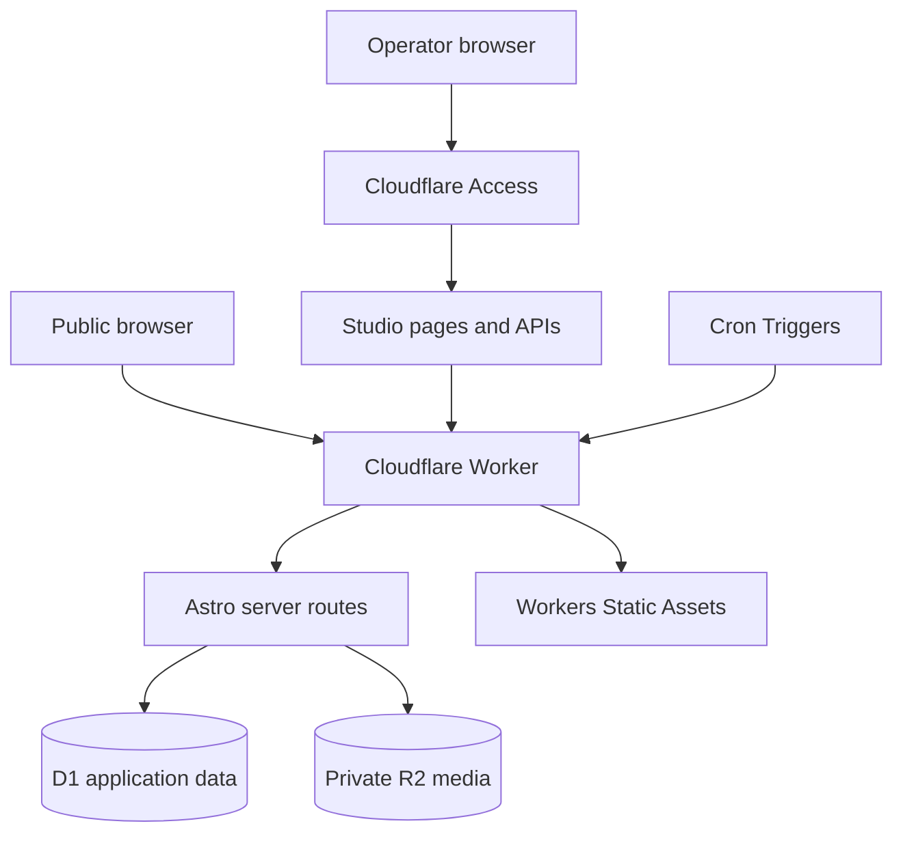

# 專案概覽 / Project Overview

[返回 README](../README.md) · [文檔索引](README.md) ·
[使用指南](USAGE.md) · [設計系統](DESIGN.md) ·
[開發指南](DEVELOPMENT.md) · [自部署指南](SELF_HOSTING.md) ·
[驗證指南](VERIFICATION.md) · [目前狀態](STATUS.md)

## 1. 產品摘要

Personal Space `v0.8.0` 是一個由單一部署者管理的雙語全端發佈網站。公開讀者無需
帳戶即可閱讀筆記、文章與經人工審閱的 Editions，並使用搜尋、時間動態、分類、
標籤、月份封存、RSS feeds 及 sitemap。內容建立、媒體、來源、修訂與發佈操作只在
受保護的 Studio 進行。

產品不提供多租戶、公開帳戶、公開投稿、訂閱、付款或 runtime 生成式 AI。每個
自部署者都應從全新的 Cloudflare 資源開始，並只使用其擁有或已獲授權的內容。

## 2. 目前能力

| 範疇       | 已提供                                                   | 主要邊界                                    |
| ---------- | -------------------------------------------------------- | ------------------------------------------- |
| 公開閱讀   | Notes、Articles、Editions、詳情頁與閱讀時間              | 只顯示已公開且仍可見的內容                  |
| 探索       | 搜尋、stream、分類、標籤、年份及月份封存                 | 私人、草稿、未列出及未到期內容不會進入結果  |
| Feeds      | 總 RSS、分內容 RSS、Editions RSS、sitemap                | 使用與公開頁相同的可見度判斷                |
| 編輯       | 草稿、預覽、發佈、排程、封存、修訂及還原                 | Studio 與寫入 API 需要 Access 和 owner 核對 |
| 媒體       | 驗證圖片上載、內容關聯及受控讀取                         | R2 保持私人；未公開媒體 fail closed         |
| 來源與選輯 | RSS／Atom 擷取、權利審閱、人工排序及 Edition 發佈        | 不內置真實來源；部署者負責條款與版權核對    |
| 排程       | 可選來源整理與 Edition generation                        | Cron 名稱與時間只留在部署者私人設定         |
| 品質       | 格式、lint、型別、單元測試、build、Worker types、dry-run | 本地或 CI 通過不等於 production 已驗證      |

實際讀者與 Studio 操作方式見 [使用指南](USAGE.md)；狀態、媒體、來源與 Edition 的
可重現核對方式見 [驗證指南](VERIFICATION.md)。

## 3. 執行架構

Astro 透過 `@astrojs/cloudflare` 產生 Cloudflare 相容的 server output。Cloudflare
Worker 是所有公開與受保護請求的 runtime；Workers Static Assets 提供建置後資產，
D1 和 R2 則保存每個部署者自己的資料。可選 Cron Triggers 進入同一 Worker 的
`scheduled` handler。

這是可公開的責任圖，不是 production 帳戶或 network topology 記錄。實際 Worker
名稱、domain、resource identifiers、Access application、policy、owner 值、secrets
與排程必須留在部署者自己的私人環境。

## 4. 請求與資料流程

| 流程      | 高層行為                                                             |
| --------- | -------------------------------------------------------------------- |
| 公開頁面  | Worker 交由 Astro route 查詢 D1，套用可見度規則後產生 HTML           |
| 靜態資產  | Worker-first 設定保留安全與路由邊界，再由 Static Assets 提供建置檔案 |
| Studio    | Cloudflare Access 先篩選，應用程式再驗證 token、audience 與 owner    |
| 寫入 API  | 驗證認證、same-origin、bounded body、輸入及狀態轉換後才寫入 D1／R2   |
| 媒體讀取  | Worker 核對媒體和已公開內容的關聯，再從私人 R2 回應                  |
| Feed 擷取 | 對可選來源執行 URL、回應大小、內容類型、解析及權利狀態檢查           |
| 排程      | Cron 對照私人設定的工作類型，重用服務層並只記錄最少狀態資料          |

詳細資料表、index、trigger、row count、object key 及 production 查詢不屬於公開
架構文檔。版本化空白環境只以 [`migrations`](../migrations) 為準。

## 5. 技術棧與責任

### 應用程式

- **Astro**：頁面、layout、components、API routes 與 server output。
- **TypeScript strictest**：主要程式碼與型別邊界。
- **Marked + sanitize-html**：Markdown parsing 與 HTML 清理。
- **fast-xml-parser**：可選 RSS／Atom 輸入解析。
- **jose**：Cloudflare Access 簽署資料驗證。

### 介面與內容

- **Semantic design tokens**：色彩角色、字型、間距、圓角、focus 及 motion 基線。
- **Astro components**：公開與 Studio 的 server-rendered layout、navigation 及狀態。
- **Responsive shells**：wide、medium 及 390px 級 mobile 的導覽與內容排列。
- **Bilingual copy**：繁體中文為主、英文輔助，保留正確語言及無障礙語意。

具體介面規則見 [DESIGN.md](DESIGN.md)。

### Cloudflare

- **Workers**：動態請求、API 及排程事件。
- **Workers Static Assets**：建置後的 CSS、SVG 與其他資產。
- **D1**：部署者自己的內容及應用資料。
- **R2**：部署者自己的私人媒體物件。
- **Access**：管理介面前置身份層；應用程式仍執行 owner 核對。
- **Cron Triggers**：可選的定時整理工作。
- **Wrangler**：本地 Worker 預覽、binding types、migration、dry-run 與部署。

### 品質與交付

- **Prettier、ESLint**：格式與靜態分析。
- **Astro check、TypeScript**：頁面及型別檢查。
- **Vitest**：服務、route、UI script 與安全邊界測試。
- **GitHub Actions**：每個 PR 及 `main` push 的固定檢查。
- **Wrangler／Workers Builds**：Cloudflare build 與 deploy 工具。

實際固定版本以 [`package.json`](../package.json) 及 lockfile 為準。Cloudflare plan、
限制與 CLI 行為可能改變，自部署前應重新查閱官方文件。

## 6. 資料責任與公開邊界

| 資料類別                       | 保存位置                              | 可否提交 Git               |
| ------------------------------ | ------------------------------------- | -------------------------- |
| 應用程式碼、通用測試與公開文檔 | Repository                            | 可以                       |
| 虛構 Markdown 範例             | Repository                            | 可以，須確認沒有個人化資料 |
| 部署者建立的內容               | 部署者自己的 D1                       | 不可以                     |
| 部署者上載的媒體               | 部署者自己的私人 R2                   | 不可以                     |
| Access、owner 與認證值         | Cloudflare secrets                    | 不可以                     |
| 本機開發值                     | 已忽略的 `.dev.vars`                  | 不可以                     |
| Cloudflare identifiers         | 已忽略的私人 Wrangler 設定／dashboard | 不可以                     |
| Logs、備份與查詢結果           | 部署者自己的受控環境                  | 不可以                     |

任何 issue、PR、測試輸出或截圖亦遵守相同邊界。必要範例只使用 `.invalid` domain、
placeholder identifiers 及合成內容。

## 7. Repository 結構

| 位置                    | 責任                                          |
| ----------------------- | --------------------------------------------- |
| `src/pages`             | 公開頁面、Studio 頁面與 API routes            |
| `src/components`        | 可重用公開及 Studio UI                        |
| `src/layouts`           | 公開和受保護頁面的共用頁框                    |
| `src/styles`            | 語意 tokens、全站樣式與 responsive 基線       |
| `src/server/auth`       | Access 驗證與 route policy                    |
| `src/server/publishing` | Notes／Articles domain、repository 與 service |
| `src/server/editions`   | Sources、ingestion、Edition 與排程服務        |
| `src/server/feeds`      | RSS、sitemap 與 XML response                  |
| `src/server/media`      | 圖片驗證、上載與 response                     |
| `src/server/http`       | JSON、origin、bounded body 與安全 headers     |
| `src/scripts`           | 瀏覽器端 Studio 行為與回應處理                |
| `src/worker.ts`         | Worker fetch／scheduled 入口                  |
| `migrations`            | 空白 D1 環境的版本化 schema 變更              |
| `tests`                 | 合成資料的自動化測試                          |
| `docs`                  | 目前指引與版本化歷史記錄                      |

## 8. 開發、發佈與證據原則

- 開發從合成資料與本地 D1 開始，不連接 production D1、R2 或內容。
- `npm run check` 是提交前的完整本地 gate，但不證明遠端已部署。
- Release tag 固定 source baseline；`main` 可以包含 `Unreleased` 變更。
- Cloudflare deploy、traffic 與 live URL 要分開直接核對，不能由 CI 或 tag 代替。
- Access 必須同時覆蓋 parent 及需要的 wildcard path；應用程式認證仍 fail closed。
- R2 保持私人，所有公開媒體都經 Worker 與內容可見度檢查。
- 自訂 domain 只在測試網址、Access、D1、R2、logs 與回復方案核對後連接。

實際使用方式見 [USAGE.md](USAGE.md)，開發流程見 [DEVELOPMENT.md](DEVELOPMENT.md)，
完整部署流程見 [SELF_HOSTING.md](SELF_HOSTING.md)，驗證矩陣見
[VERIFICATION.md](VERIFICATION.md)，狀態用語見 [STATUS.md](STATUS.md)。

## 9. 技術與 AI 聲明

Production runtime 沒有 AI binding、模型 API 或自動生成內容流程，也不會因本專案
的執行而把訪客或部署者資料傳送給生成式 AI 供應商。開發工具產生的變更仍必須由
維護者審閱，並通過測試與敏感資料檢查後才可採用。

## English summary

Personal Space `v0.8.0` is a single-operator, bilingual publishing application
for Cloudflare Workers. Astro renders public pages and protected Studio routes;
Workers Static Assets serves built assets; D1 stores operator-owned application
data; and private R2 stores media. Cloudflare Access is an outer authentication
layer, while the application still verifies the token and owner identity.

The public repository contains source code, generic configuration templates,
versioned migrations for a fresh database, synthetic tests, and public-safe
documentation. It must not contain real content, owner details, secrets,
resource identifiers, exports, logs, backups, or private operational topology.
Local checks, CI, releases, deployments, and live verification are distinct
forms of evidence.

Use `USAGE.md` for reader and Studio workflows, `DESIGN.md` for the observable
interface system, `DEVELOPMENT.md` for local engineering, `SELF_HOSTING.md` for
Cloudflare deployment, and `VERIFICATION.md` for reproducible QA boundaries.
